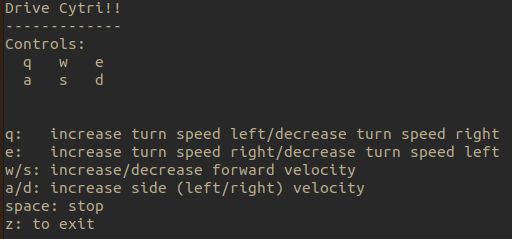

# CyTri Control Package: Remote control of three wheeled robotic platform

Author and Maintainer: **Ryan King-Shepard**

## **Description**
ROS package for RC control of a three wheeled robot over wifi with Google Coral

This package contains:

- nodes:
    1. `cytri_controller` ~ Reads commanded velocity and current wheel speed to determine PWM to send to motors
    2. `keyboard_control` ~ RC interface with the user
    3. `pico_interface` ~ Serial interface between raspberry pi pico and motors. Reads encoder values and publishes PWM
- config:
    * `robot_params.yaml` ~ Parameters for physical characteristics of the robot 
- launch: 
    * `remote_control.launch` ~ Set remote control with keyboard interface
- msg:
    * `Encoders` ~ custom message for encoder counts
    * `PWMS` ~ custom message for signed PWM. 
- `package.xml`
    * Package configuration
- `CMakeLists.tx`
    * Build configuration
- `README.md`
    * Tis but a humble text file


## **Dependencies and Installation**

This guide assumes you have completed the initial [setup guide](https://coral.ai/docs/dev-board/get-started/) for the Google Coral Board.

### *ROS Dependencies*
This package was developed and tested in ros-noetic. This guide will walk though installing ros-base on the Google coral.

1. Add the sources.list

```
sudo sh -c 'echo "deb http://packages.ros.org/ros/ubuntu buster main" > /etc/apt/sources.list.d/ros-latest.list'
```

2. Set up the keys

```
curl -s https://raw.githubusercontent.com/ros/rosdistro/master/ros.asc | sudo apt-key add -
```

3. Update and Install

```
sudo apt update
sudo apt install ros-noetic-ros-base
```

### *Python Dependencies*
All code for this package was developed and test in Python 3. Other required packages:

- `numpy` for mathematical utilities. 
- `getkey` for parsing user input.
- `python-periphery` for serial connection, PWM signal, and general GPIO utilities

All packages can be installed with pip. 
 

## **Execution**

### Connect to Google Coral Board
1. Ensure the cytri_control_pkg is placed on the Google Coral Board. This project uses git for ease of development, but porting the package over using `rsync` is another option. 

2. Ensure ROS noetic is sourced.
    `source /opt/ros/noetic/setup.bash`

3. Build the cytri_control_pkg with catkin_make and then source it
    `source devel/setup.bash`

### Remote Control

To run remote control, simply launch the remote_control launch file:
`roslaunch cytri_control_pkg remote_control`. 

You should see a screen like so in your terminal:


Happy Driving!!


